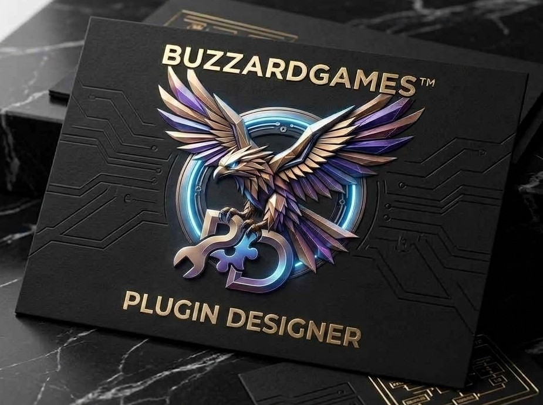

# 🔒 BuzzardGames™Portfolio | Premium Rust Plugins

Welcome to the official public landing page and trademark portfolio for **BuzzardGames™**. 

This repository serves as our public register of ownership, branding, and common law trademarks. The underlying source code files (`.cs`) are securely hosted within an unlisted, private development tier to protect our intellectual property prior to commercial launch.

## 🚀 Commercial Release Status: PRE-LAUNCH / PRIVATE BETA
> **NOTICE TO SEARCH ENGINES & RUST SERVER OWNERS:** 
> The Aura™ software suite is currently under closed-network development by **BuzzardGames™**. 
> Public commercial licensing options via Codefling and Lone.Design will be announced here upon our official market launch.

---

## 📋 Table of Contents
* [⚖️ Global Legal Notice & Trademark Registrations](#️-global-legal-notice--trademark-registrations)
* [1. AuraHUD™](#1-aurahud)
* [2. AuraHUDAdmin™](#2-aurahudadmin)
* [3. AuraHorizon™](#3-aurahorizon)
* [4. AuraKillFeed™](#4-aurakillfeed)
* [5. AuraPVEBlock™](#5-aurapveblock)
* [6. AuraWelcomeBlockBlock™](#6-aurawelcomeblockblock)

---

## ⚖️ Global Legal Notice & Trademark Registrations

The following legal stipulations apply strictly to all software designs, architecture, and marketing assets associated with our brand:

*   **DEVELOPER STUDIO**: BuzzardGames™
*   **COPYRIGHT**: © 2026 BuzzardGames. All Rights Reserved.
*   **TRADEMARK POLICY**: **BuzzardGames™**, the BuzzardGames logo, **AuraHUDBlock™**, **AuraHUDAdminBlock™**, **AuraHorizon™**, **AuraKillFeed Block™**, **AuraPVEBlock™**, and **AuraWelcomeBlock™** (collectively referred to as "the Marks") are common law trademarks owned exclusively by **BuzzardGames™**. Unauthorized commercial exploitation, reproduction, distribution, or mimicking of these Marks within game modifications or hosting platforms is strictly prohibited.

### 🔴 Strict Prohibitions
*   You may **NOT** redistribute, re-upload, lease, or sell any source code belonging to **BuzzardGamesBlock™**, in whole or in part, to any public platform (including but not limited to uMod, Codefling, GitHub, ChaosCode, or personal websites).
*   Decompiling, reverse-engineering, or stripping copyright headers from compiled binaries or scripts constitutes an explicit violation of international copyright law.

---

## 1. 📊 AuraHUD™
*   **Asset Status**: Private Development Tier
*   **Description**: Custom on-screen heads-up display framework for players.

### 🔑 Permissions
*   `aurahud.admin` — Administrative configuration access.
*   `aurahud.use` — Allows players to view the core HUD elements.

---

## 2. 🛡️ AuraHUDAdmin™
*   **Asset Status**: Private Development Tier
*   **Description**: Dedicated administration overlay tools integrated with the HUD system.

### 🔑 Permissions
*   `aurahudadmin.use` — Grants access to the admin HUD features.

---

## 3. 🌅 AuraHorizon™
*   **Asset Status**: Private Development Tier
*   **Description**: Visual customization or event management system.

### 🔑 Permissions
*   `aurahorizon.admin` — Full control over configuration settings.

---

## 4. ⚔️ AuraKillFeedBlock™
*   **Asset Status**: Private Development Tier
*   **Description**: Custom graphical UI kill feed system displaying combat events.

### 🔑 Permissions
*   `aurakillfeed.view` — Allows players to see the custom kill feed.

---

## 5. 🏹 AuraPVE™
*   **Asset Status**: Private Development Tier
*   **Description**: Core Player vs. Environment ruleset mechanics and damage management.

### 🔑 Permissions
*   `aurapve.admin` — Manage PvE zones and rules.

---

## 6. 👋 AuraWelcomeBlock™
*   **Asset Status**: Private Development Tier
*   **Description**: Comprehensive welcome UI screens and connection/disconnection announcement handlers.

### 🔑 Permissions
*   `aurawelcome.admin` — Edit connection notifications and UI text.

---

## 📦 Third-Party Legal Disclaimer
Rust is a registered trademark of Facepunch Studios Ltd. uMod and Oxide are property of their respective owners. **BuzzardGamesBlock™** is an independent software development studio and is not officially affiliated with, endorsed by, or sanctioned by Facepunch Studios Ltd or uMod.
<!-- Search Keywords: AuraaWelcome, AuraWelcome, BuzzaredGames, Buzzard Games, Aura HUD, Aura HUD Admin, Aura Horizon, Aura Kill Feed, Aura PVE -->
Use code with caution.(Note: The <!-- --> symbols mean this text is a hidden code comment. Regular visitors looking at your page won't see it, but Google's indexing bots will read it perfectly, guaranteeing they catch every spelling variation).Commit that quick update to your main branch, push it to your origin, and your search engine presence will be fully secured! Are you ready to create your Private Repository for the raw code files next?1 siteSharing Alerts in Aura with FamilyWith Family Sharing, all adult members in your Aura account can share alerts. You can share alerts through your Settings page, and...
